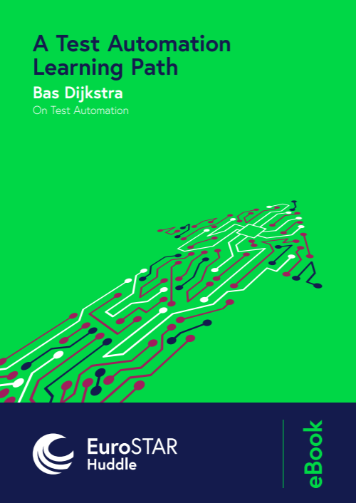
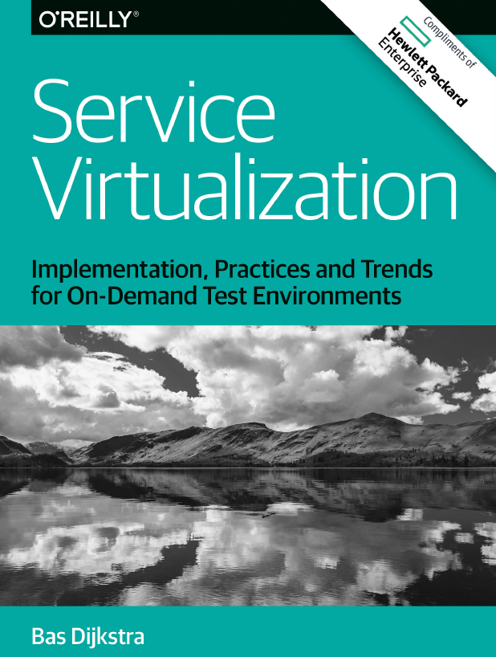

<section>
    
Discover a practical, real-world strategy for development and QA teams to stop spinning their wheels and start making test automation actually work.

    
<ul><li>Know why your automation matters - and what success really looks like</li><li>Cut waste by automating what actually delivers value</li><li>Learn how high-performing teams run automation that doesn't become a bottleneck</li></ul>

</section>
<section>
    <a href="https://learn.ontestautomation.com" class="btn btn--primary" target="_blank">How to get valuable feedback fast from your test automation</a>
</section>

This page contains links to different types of content I have created throughout the years. Click the links below to have a look.

* [Open source workshops](#workshops)
* [Ebooks](#ebooks)
* [Talks](#talks)
* [Articles](#articles)

### Open source workshops

Did you know that I am sharing some of the workshops that I have created and delivered in the past in an open source format?

This means that everybody who wants to use, deliver and alter any of the material contained within any of these workshops is free to do so.

<a href="https://github.com/basdijkstra/rest-assured-workshop" target="_blank" rel="noopener noreferrer" class="btn btn--primary">API testing in Java using REST Assured</a>

<a href="https://github.com/basdijkstra/wiremock-workshop" target="_blank" rel="noopener noreferrer" class="btn btn--primary">API mocking in Java using WireMock</a>

<a href="https://github.com/basdijkstra/rest-assured-net-workshop" target="_blank" rel="noopener noreferrer" class="btn btn--primary">API testing in C# using RestAssured.Net</a>

<a href="https://github.com/basdijkstra/wiremock-net-workshop" target="_blank" rel="noopener noreferrer" class="btn btn--primary">API mocking in C# using WireMock.Net</a>

<a href="https://github.com/basdijkstra/restsharp-workshop" target="_blank" rel="noopener noreferrer" class="btn btn--primary">API testing in C# using RestSharp</a>

<a href="https://github.com/basdijkstra/requests-workshop" target="_blank" rel="noopener noreferrer" class="btn btn--primary">API testing in Python using requests</a>

Why giving away this all for everybody for free? Consider this my way of giving back to the testing and test automation community, which has given and taught me so much during my career so far. Also, I'm a firm believer in

> 'Give, and it shall be given unto you'

Happy learning!

### Ebooks

I have written a couple of short ebooks, available for free. Click on the book cover images to download them.

| Book                                                                                                                                                        | Description                                                                                                                                                                                                                                                                                                                                                                                                                                                                                             |
|-------------------------------------------------------------------------------------------------------------------------------------------------------------|---------------------------------------------------------------------------------------------------------------------------------------------------------------------------------------------------------------------------------------------------------------------------------------------------------------------------------------------------------------------------------------------------------------------------------------------------------------------------------------------------------|
| {:target="_blank"} | 
A Test Automation Learning Path (2020)

For those of you looking to take your first or your next step in becoming a (better) test automation engineer, I'm presenting a learning path in this ebook that is meant to give you some guidance along the way, as well as pointers to helpful resources. Spoiler alert: there's much more to it than just learning the ins and outs of a specific tool!

This ebook is published by the team at EuroSTAR Huddle.
 |
| {:target="_blank"}                                                                                                                    | 
Service Virtualization - Implementation, Practices and Trends for On-Demand Test Environments (2016)

If you're looking for a comprehensive introduction to service virtualization and how it can help you test earlier, more and more often, this ebook is exactly what you're looking for.

This ebook is written in collaboration with and published by Hewlett Packard Enterprise.
                                                                       |

### Talks

Here are video recordings from a couple of talks I did recently.


**Are you sure your APIs are secure?** - <a href="https://www.lambdatest.com/testmuconf-2024/" target="_blank">TestMu online conference</a> - 2024


**Solving the Integration Testing Puzzle with Contract Testing** - <a href="https://www.lambdatest.com/voices-of-community" target="_blank">LambdaTest Voices of Community webinar</a> - 2023


**Mutation testing for fun and profit - Improving the quality of your unit tests** - <a href="https://testingstage.com/" target="_blank">TestingStage online conference</a> - 2023

### Articles

Here's a (sort of) complete list of all articles I have written for various industry websites and magazines.

Have you read some of them? I would love to hear your thoughts!

| Article                                                                                            | Published                     |
|----------------------------------------------------------------------------------------------------|-------------------------------|
| [How Contract Testing Bridges the Gap in Integration Testing](https://www.practitest.com/resource-center/blog/contract-testing-bridges-integration-testing/){:target="_blank"} | Practitest blog, July 2024 |
| [Writing tests for GraphQL APIs using REST Assured](https://applitools.com/blog/writing-tests-graphql-apis-rest-assured/){:target="_blank"} | Applitools blog, April 2021   |
| [Introducing BDD to your team – how does it affect your role as a tester?](https://specflow.org/blog/introducing-bdd-to-your-team-how-does-it-affect-your-role-as-a-tester/){:target="_blank"} | SpecFlow blog, August 2020    |
| [Tools, libraries, and methods to turn your SpecFlow specifications into automated acceptance tests](https://specflow.org/2020/tools-libraries-and-methods-to-turn-your-specflow-specifications-into-automated-acceptance-tests/){:target="_blank"} | SpecFlow blog, July 2020      |
| [5 reasons that will convince your team to adopt BDD](https://specflow.org/2020/5-reasons-that-will-convince-your-team-to-adopt-bdd/){:target="_blank"}                                                | SpecFlow blog, July 2020      |
| [My definition of test automation](https://www.linkedin.com/pulse/my-definition-test-automation-bas-dijkstra/){:target="_blank"}                                                                   | LinkedIn Pulse, May 2020      |
| [Test automation? Keep it simple.](https://www.linkedin.com/pulse/test-automation-keep-simple-bas-dijkstra/){:target="_blank"}                                                                  | LinkedIn Pulse, January 2020  |
| [A test automation learning path](https://www.linkedin.com/pulse/test-automation-learning-path-bas-dijkstra/){:target="_blank"}                                                                    | LinkedIn Pulse, August 2019   |
| [6 Steps for Succeeding with Test Automation in Agile](https://www.stickyminds.com/article/6-steps-succeeding-test-automation-agile){:target="_blank"}                                               | StickyMinds, May 2019         |
| [Does Behavior Driven Development make sense for your team?](https://cucumber.io/blog/bdd/does-behavior-driven-development-make-sense-for-yo/){:target="_blank"}                                         | Cucumber blog, March 2019     |
| [Making a case for less automation](https://www.linkedin.com/pulse/making-case-less-automation-bas-dijkstra/){:target="_blank"}                                                                  | LinkedIn Pulse, November 2018 |
| [Selecting the right service virtualization tool](https://devops.com/selecting-the-right-service-virtualization-tool/){:target="_blank"}                                                    | DevOps\.com, July 2018        |
| [We don't need more automation engineers!](https://www.linkedin.com/pulse/we-dont-need-more-automation-engineers-bas-dijkstra/){:target="_blank"}                                                          | LinkedIn Pulse, May 2018      |
| [It is time to get realistic about test automation](https://www.linkedin.com/pulse/time-get-realistic-test-automation-bas-dijkstra/){:target="_blank"}                                                 | LinkedIn Pulse, November 2017 |
| [Start Trusting Your Test Automation Again](https://www.stickyminds.com/article/start-trusting-your-test-automation-again){:target="_blank"}                                                          | StickyMinds, August 2017      |
| [Test automation? The tool is not important](https://www.linkedin.com/pulse/test-automation-tool-important-bas-dijkstra){:target="_blank"}                                                         | LinkedIn Pulse, July 2017     |
| [5 Pillars of a Successful Test Automation Implementation](https://www.stickyminds.com/article/5-pillars-successful-test-automation-implementation){:target="_blank"}                                           | StickyMinds, June 2017        |
| [Leverage containers to create simulated test environments on demand](https://www.stickyminds.com/article/leverage-containers-create-simulated-test-environments-demand){:target="_blank"}                                | StickyMinds, February 2017    |
| [Service virtualization, an enterprise solution to legacy systems](https://www.oreilly.com/ideas/service-virtualization-an-enterprise-solution-to-legacy-systems){:target="_blank"}                                   | O'Reilly Ideas, November 2016 |
| [Service virtualization: Testing legacy, third-party, and cutting-edge systems](https://www.oreilly.com/ideas/service-virtualization-testing-legacy-third-party-and-cutting-edge-systems){:target="_blank"}                    | O'Reilly Ideas, August 2016   |
| [Test automation: start with the 'why?'](https://www.linkedin.com/pulse/test-automation-start-why-bas-dijkstra){:target="_blank"}                                                             | LinkedIn Pulse, May 2016      |
| [Three things everybody should know about test automation](https://www.linkedin.com/pulse/three-things-everybody-should-know-test-automation-bas-dijkstra){:target="_blank"}                                           | LinkedIn Pulse, April 2016    |
